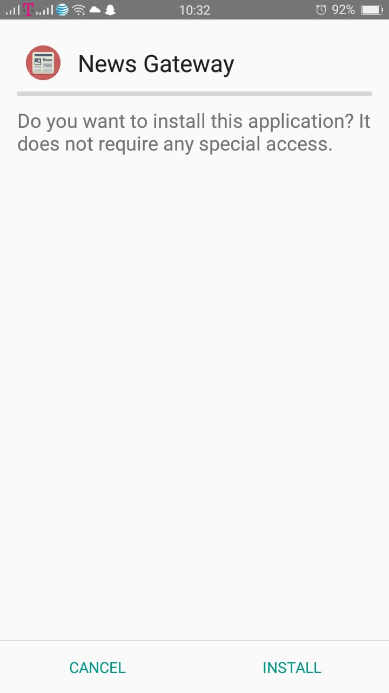
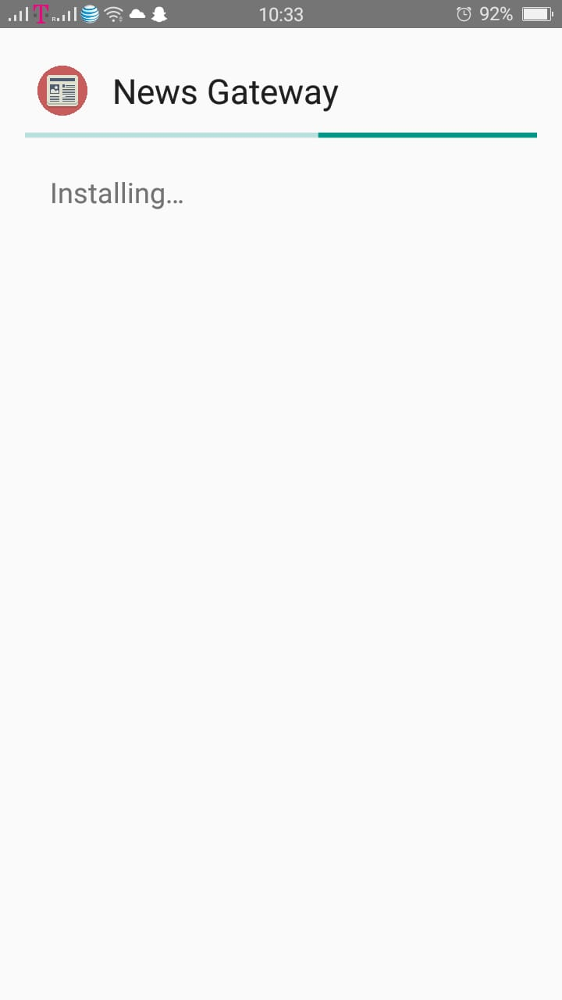
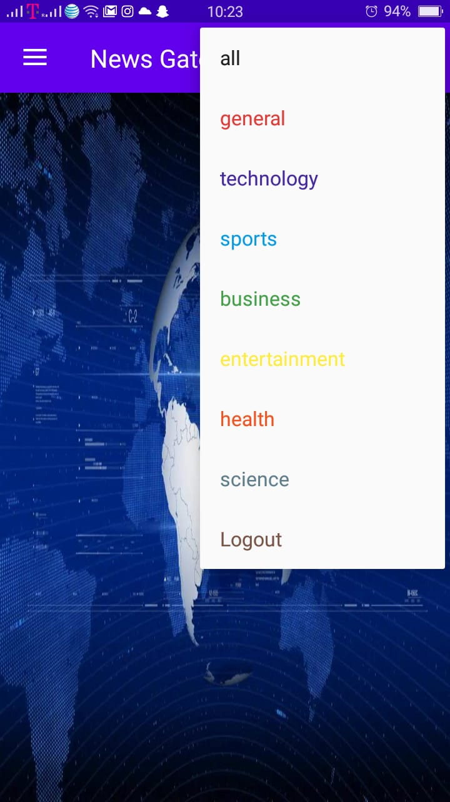
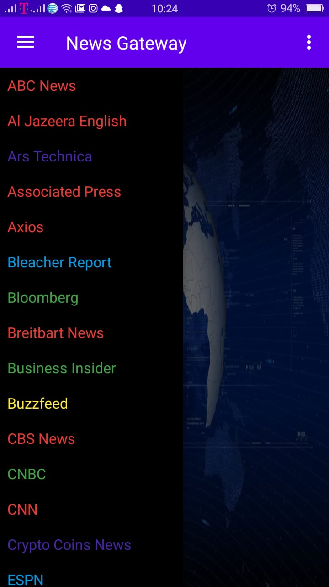
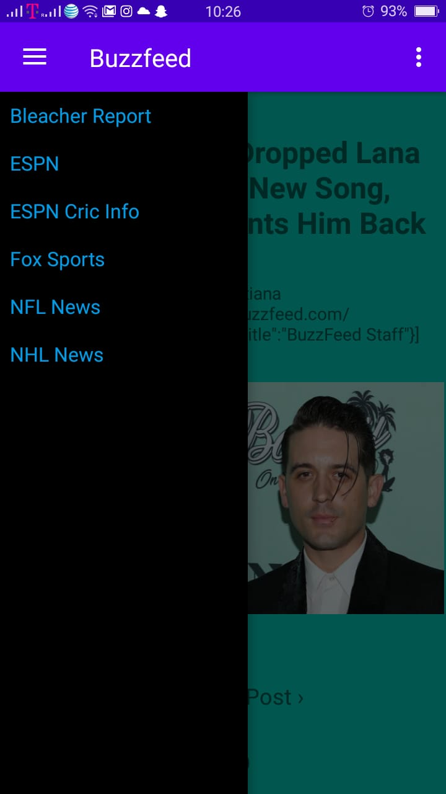

# News-Gateway-Android-Application

An android application which displays current news articles from a wide variety of news sources covering a range of news categories. It is built using Android X library jetpacks, google login API and News.org API

## 1) App Installation

Below are the screenshots while installing the News Gateway application.

## 2) App Icon

On installing the app, its icon is shown as set.

## 3) Login Page through google sign in

Option to choose account for google sign in.

## 4) Invalid Login

## 5) Invalid attempt 1

## 6) Invalid attempt 2

## 7) Invalid attempt 3

## 8) Homepage

Home page after successful login.

## 5) News Category

## 6) News Source

## 7) News Articles

## 8) Option to change news source

